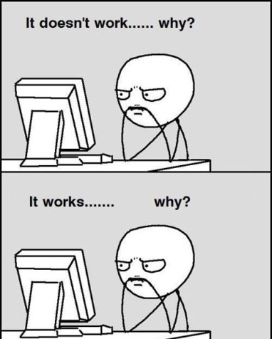

---
format:
  html:
    code-fold: false
jupyter: python3
---

# Debugging

Programs rarely work correctly on the first attempt. The process of finding and fixing errors in code is called *debugging*, a term that has become so fundamental to programming that understanding it deeply is essential for any programmer. Before we can fix bugs effectively, we must first understand what kinds of bugs exist and how they manifest themselves.

## Three Categories of Bugs

Bugs fall into three fundamentally different categories based on *when* and *how* they manifest: syntax errors (detected before execution), runtime errors (crashes during execution), and logical errors (silent wrong results). This distinction matters because each category requires different detection strategies and fixing approaches.

### Syntax Errors: The Interpreter's Complaints

A syntax error occurs when code violates the grammatical rules of the programming language. Python cannot even begin to execute code that contains syntax errors because the interpreter cannot parse the instructions into something meaningful. These errors are caught immediately when Python first reads the code, before any execution occurs.

Consider what happens when we forget a colon after an `if` statement:

```{python}
#| error: true
if x > 5
    print("x is large")
```

Python responds with a `SyntaxError` and points to where it detected the problem. The interpreter expected a colon after the condition but found something else instead. Common syntax errors include missing colons after `if`, `for`, `while`, and function definitions; mismatched parentheses or brackets; incorrect indentation; and misspelled keywords.

The crucial characteristic of syntax errors is that they prevent the program from running at all. This makes them, paradoxically, the *easiest* bugs to fix. The interpreter tells us exactly where the problem is, and the fix is usually obvious once we see it. A missing colon needs a colon; a missing parenthesis needs its partner.

### Runtime Errors: Crashes During Execution

Runtime errors occur when syntactically correct code attempts an impossible operation during execution. The program starts running successfully but crashes when it encounters the problematic operation. Python calls these *exceptions*.

```{python}
#| error: true
numbers = [1, 2, 3]
print(numbers[10])  # No index 10 exists
```

The code is syntactically valid, but asking for the eleventh element of a three-element list is impossible. Python raises an `IndexError` and halts execution. Common runtime errors include division by zero, accessing nonexistent list indices or dictionary keys, calling methods on `None`, and attempting operations on incompatible types.

Runtime errors share characteristics with both syntax and logical errors. Like syntax errors, they produce explicit error messages that point to the problem location. But unlike syntax errors, they only appear under certain conditions during execution. A division-by-zero error might lurk in code for months until some input finally produces a zero denominator.

```{python}
#| error: true
def compute_ratio(a, b):
    return a / b

# Works fine for most inputs
print(compute_ratio(10, 2))
print(compute_ratio(7, 3))
# But crashes when b happens to be zero
print(compute_ratio(5, 0))
```

The function is syntactically correct and works for many inputs. The bug only reveals itself when a particular combination of inputs triggers the impossible operation.

### Logical Errors: Silent Failures

Logical errors are far more insidious than either syntax or runtime errors. Code with logical errors is syntactically correct *and* runs without crashing, but it produces wrong results. The interpreter cannot detect these errors because the code follows all grammatical rules and performs only valid operations; it simply does not do what the programmer intended.

Consider a function meant to calculate the average of a list:

```{python}
def calculate_average(numbers):
    total = 0
    for num in numbers:
        total += num
    return total / len(numbers) + 1  # Bug: the +1 should not be here

result = calculate_average([10, 20, 30])
print(f"Average: {result}")
```

This code runs without any errors and produces output. But the result is wrong because of the spurious `+1` at the end. Python cannot know that we did not intend to add one to our average. The code does exactly what we wrote, which unfortunately is not what we meant.

Logical errors manifest in many forms: using the wrong variable, applying operations in the wrong order, implementing formulas incorrectly, or misunderstanding how a function behaves. These bugs can lurk undetected for long periods, especially when they only affect edge cases or produce results that *look* plausible. No error message appears because, from Python's perspective, nothing went wrong.

### A Note on Static vs Dynamic Languages

Python is a *dynamically typed* language, meaning that type checking happens during execution rather than before it. This is why errors like passing an integer to a function expecting a string only appear at runtime when the code actually runs. In *statically typed* languages like Java, C++, or TypeScript, the compiler analyzes the code before execution and catches many such errors early. Code that attempts to call `.upper()` on an integer would not even compile in Java because the compiler knows integers lack that method.

This difference has practical implications. Many errors that are runtime errors in Python would be syntax-like errors in statically typed languages, caught before any code executes. Static typing trades some flexibility for earlier error detection. Python's dynamic typing allows more expressive code but shifts the burden of catching type-related errors to testing and runtime. Neither approach is inherently superior; they represent different trade-offs that suit different contexts.

## Reading Error Messages

Python's error messages, called *tracebacks*, provide essential information for debugging. Learning to read them carefully is a fundamental skill.

```{python}
#| error: true
def process_data(data):
    return data.upper()

def main():
    values = [1, 2, 3]
    for v in values:
        result = process_data(v)
        print(result)

main()
```

The traceback shows the sequence of function calls that led to the error, with the most recent call at the bottom. We see that `main()` called `process_data(v)`, which then tried to call `data.upper()`. The final line tells us the error type (`AttributeError`) and what went wrong: integers have no `upper` method.

Reading tracebacks from bottom to top often helps. The bottom shows *what* went wrong; working upward shows *how* we got there. In this case, we passed an integer to a function expecting a string.

## Debugging Strategies

When faced with a bug, systematic approaches work better than random changes.

### Print Debugging

The simplest debugging technique involves inserting print statements to reveal what the program is actually doing. When a function produces wrong results, print the inputs it receives and the intermediate values it computes.

```{python}
def mystery_calculation(a, b):
    print(f"Inputs: a={a}, b={b}")  # Debug print
    step1 = a * 2
    print(f"After step1: {step1}")  # Debug print
    step2 = step1 + b
    print(f"After step2: {step2}")  # Debug print
    result = step2 ** 2
    print(f"Final result: {result}")  # Debug print
    return result

mystery_calculation(3, 4)
```

By observing the actual values at each step, we can identify where the computation diverges from our expectations. This technique is crude but effective, especially for simple bugs.

### Using the VS Code Debugger

Print debugging works, but it requires modifying code and manually inserting statements everywhere. VS Code provides a built-in debugger that offers a more sophisticated approach: you can pause execution at any line, inspect all variables, and step through code one line at a time without modifying your source files.

```{=html}
<video width="100%" height="auto" controls autoplay loop muted style="width: 100%; height: auto;" >
  <source src="graphics/debugVSCode.mp4" type="video/mp4">
  Your browser does not support the video tag.
</video>
```

**Setting Breakpoints**

A *breakpoint* tells the debugger to pause execution when it reaches a specific line. To set a breakpoint in VS Code, click in the gutter to the left of the line number. A red dot appears, indicating the breakpoint. When you run the program in debug mode, execution pauses at that line before it executes.

To start debugging, press `F5` or select "Run → Start Debugging" from the menu. The program runs normally until it hits a breakpoint, then pauses. At this point, you can examine the current state of all variables in the "Variables" panel on the left side of the screen.

**Stepping Through Code**

Once paused at a breakpoint, you have several options for continuing execution:

- **Step Over** (`F10`): Execute the current line and pause at the next line. If the current line contains a function call, the entire function executes without pausing inside it.
- **Step Into** (`F11`): If the current line contains a function call, enter that function and pause at its first line. This lets you trace execution into functions you want to examine.
- **Step Out** (`Shift+F11`): Continue execution until the current function returns, then pause in the calling function.
- **Continue** (`F5`): Resume normal execution until the next breakpoint or the program ends.

**Inspecting Variables**

While paused, the Variables panel shows all variables in the current scope along with their values. You can expand complex objects to see their contents. The Debug Console at the bottom allows you to type Python expressions and see their values, which is useful for testing hypotheses about what might be wrong.

**Conditional Breakpoints**

Sometimes a bug only occurs under specific conditions. Right-click on a breakpoint and select "Edit Breakpoint" to add a condition. The debugger will only pause when that condition is true. For example, setting the condition `i == 50` on a breakpoint inside a loop causes the debugger to pause only on the 50th iteration.

The debugger is particularly valuable for logical errors where you need to trace how values change over time. Rather than guessing where to add print statements, you can set a breakpoint near where you suspect the problem and step through the code watching variables change.


### Isolating the Problem

Complex programs require systematic isolation of bugs. If a large program produces wrong output, the bug could be anywhere. The strategy is to narrow down the location by testing smaller pieces independently.

Start by identifying which function or section produces incorrect results. Test that function in isolation with known inputs. If it works correctly alone, the bug may be in how it interacts with other code. If it fails in isolation, narrow down further by testing individual operations within it.

### Minimal viable example

When a bug is hard to isolate, create a minimal viable example (MVE) that reproduces the problem with as little code as possible. Strip away unrelated functionality until only the code necessary to trigger the bug remains. This often clarifies the issue and makes it easier to reason about.

### Do not copy code blindly - from *anywhere*

::: {.callout-important}
It is tempting to just paste code in and run in YOLO mode. However, it is often much more tedius to work out what the pasted code is doing wrong, than to write it from scratch carefully. Always understand every line of code you write or copy. If you do not understand it, you cannot debug it. Certainly do not use the teachers to debug code you do not understand! That is one of the deadly sins in our courses.
:::

### Rubber Duck Debugging

Sometimes explaining the problem to someone else reveals the solution. The act of articulating what the code should do and what it actually does forces careful examination of assumptions. A rubber duck on your desk serves this purpose adequately; the duck need not understand Python, but the programmer explaining to the duck often discovers their own error mid-sentence. The trick is to explain carafully every line of code and its intended purpose.

## Exception Handling

Python provides structured ways to handle runtime errors gracefully rather than crashing. The `try`-`except` construct catches exceptions and allows the program to respond appropriately.

```{python}
def safe_divide(a, b):
    try:
        result = a / b
        return result
    except ZeroDivisionError:
        print("Cannot divide by zero")
        return None

print(safe_divide(10, 2))
print(safe_divide(10, 0))
```

The `try` block contains code that might raise an exception. If an exception occurs, Python jumps to the matching `except` block instead of crashing. The program continues executing after handling the exception.

We can catch specific exception types to handle different errors differently:

```{python}
def process_input(data):
    try:
        number = int(data)
        result = 100 / number
        return result
    except ValueError:
        print(f"'{data}' is not a valid integer")
        return None
    except ZeroDivisionError:
        print("Cannot use zero as input")
        return None

print(process_input("5"))
print(process_input("hello"))
print(process_input("0"))
```

Exception handling is not a substitute for fixing bugs. Use it to handle genuinely exceptional situations: invalid user input, missing files, network failures. Do not use it to mask logical errors in your own code. If a function can receive invalid arguments, fix the calling code rather than catching the resulting exception.

### The misuse of exception handling
A common anti-pattern is to use broad exception handling to hide bugs:
```python
try:
    # complex code
except Exception:
    pass  # Silently ignore all errors
    # TODO: I'll fix this later - and other lies you tell yourself
```

An even more creative misuse, increasingly seen in the age of AI assistants:
```python
import openai

def solve_problem():
    code = "result = 1 / 0"  # My brilliant code
    while True:
        try:
            exec(code)
            return result
        except Exception as e:
            # Let the AI fix it for me!
            response = openai.ChatCompletion.create(
                model="gpt-4",
                messages=[{"role": "user",
                           "content": f"Fix this error: {e}\nCode: {code}"}]
            )
            code = response.choices[0].message.content
            # What could possibly go wrong?
```

This approach treats programming as a slot machine where you keep pulling the lever until you win. It does not work. The AI cannot understand your intent any better than Python can, and you end up with code that appears to run but does something entirely different from what you needed.

This is unfortunately common in beginner code. It makes debugging impossible because errors are silently ignored. Never catch all exceptions without at least logging them. Always aim to fix the underlying bug rather than hiding it. 

In some industries, [exception handling is outright banned](https://youtu.be/Gv4sDL9Ljww). Forcing engineers to predict and handle all error conditions explicitly.


## The Debugging Mindset

Effective debugging requires accepting that the computer does exactly what you told it to do. When code misbehaves, the fault lies in the instructions you gave, not in Python's execution of them. The bug is in your mental model of what the code does, and debugging is the process of aligning that model with reality.

Resist the temptation to make random changes hoping something will work. Each change should be based on a hypothesis about what might be wrong. Test that hypothesis systematically. If the change does not fix the bug, revert it before trying something else; accumulating random changes makes the code harder to understand and the bug harder to find.

{fig-align="center"}

Finally, remember that preventing bugs is easier than fixing them. Write small functions that do one thing well. Test each function as you write it, before building larger structures on top. Use clear variable names that reveal intent. The best debugging session is one that never needs to happen because the code was written carefully in the first place.