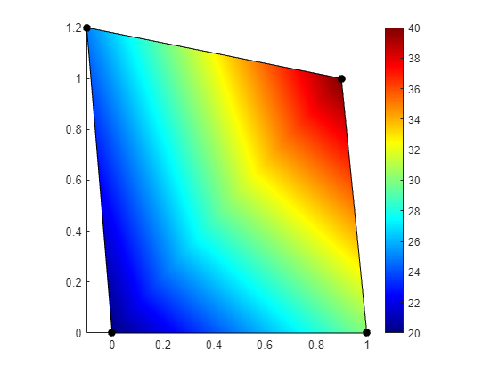

## Introduction: The Objective

In many fields of engineering and scientific visualization, it is necessary to represent scalar data defined at the vertices of a polygon with a smooth, interpolated color fill. A common tool for this task is MATLAB, which handles such requirements with its `patch` function. We begin with a representative example in MATLAB, where a quadrilateral is defined by four vertices `P` and a scalar value `U` is assigned to each vertex.

```matlab
P = [0   0
     1.0   0
     0.9  1.0
     -0.1,  1.2];
U = [20
     30
     40
     25];
figure
patch("Faces",[1,2,3,4],'Vertices', P, 'CData', U, 'FaceColor', 'interp')
hold on; axis equal tight; colormap jet; colorbar
```

The interpolated shading is achieved through the `'FaceColor', 'interp'` argument, which instructs the program to interpolate the `CData` values across the face of the polygon. This process results in a smooth gradient that accurately represents the data variation, as shown in the figure below.



Our objective is to replicate this behavior in Python using the Matplotlib library. This exploration, while appearing straightforward, will reveal a fundamental trade-off between computational performance and visual fidelity, highlighting important details about how different rendering methods operate.

## Approach 1: Direct Rendering with `tripcolor`

A direct approach for plotting on an arbitrary polygon in Matplotlib is to first decompose it into a set of triangles, a process known as triangulation. Once we have a triangulated mesh, we can employ a function designed for such meshes. The most direct tool for this purpose is `ax.tripcolor`. When combined with the `shading='gouraud'` argument, this function instructs the rendering backend to perform linear interpolation of the color at each vertex across the face of the triangle. This method is performant and memory-efficient because it passes the geometry directly to the renderer, often leveraging hardware acceleration.

A quadrilateral, however, can be triangulated in two ways by choosing either of its two internal diagonals. Let us consider the case where we split the quad along the diagonal connecting vertices `v0` and `v2`.

```{python}
# | code-fold: true
# quad_tripcolor_diagonal_v0v2.py
import numpy as np
import matplotlib.pyplot as plt
from matplotlib.tri import Triangulation

# Data for the original quadrilateral
P_verts = np.array([
    [0, 0],      # v0
    [1.0, 0],    # v1
    [0.9, 1.0],  # v2
    [-0.1, 1.2]  # v3
])
U_vals = np.array([20, 30, 40, 25])
x, y = P_verts[:, 0], P_verts[:, 1]

# Triangulation using the (v0-v2) diagonal
triangles = [[0, 1, 2], [0, 2, 3]]
triang = Triangulation(x, y, triangles=triangles)

# --- Plotting ---
fig, ax = plt.subplots()
tpc = ax.tripcolor(triang, U_vals, cmap='jet', shading='gouraud', 
                   vmin=U_vals.min(), vmax=U_vals.max())
ax.set_aspect('equal')
ax.axis('tight')
fig.colorbar(tpc, ax=ax)
plt.show()
```

The resulting plot, appears reasonable at first glance. However, it exposes a limitation of this direct approach.

`tripcolor` performs a mathematically *linear* interpolation of the data values over each triangle. Linear as in taking the nodal values and interpolating linearly between them. The interpolated values do not correspond to the colormap as we can clearly see. We expect the line between node 1 and 3 (lower left and upper right corners) to be colored according to the colormap and look exactly like the colorbar. Which clearly is not the case! 

## Approach 2: Smoothed Rendering with `tricontourf`

To obtain a visually more accurate gradient that more closely matches the MATLAB output, we now consider an alternative method, `ax.tricontourf`. This function operates not by rendering the geometric primitives directly, but by first creating a fine raster grid and interpolating the vertex data onto it. The crucial step is that it then calculates the regions between a large number of contour `levels`. Each of these regions is filled with a single solid color sampled from the colormap. By specifying many levels, we simulate a near-continuous gradient. This process effectively honors the (often non-linear) color transitions of the colormap itself, producing the desired visual result.

```{python}
# | code-fold: true
# quad_tricontourf_diagonal_v0v2.py
import numpy as np
import matplotlib.pyplot as plt
from matplotlib.tri import Triangulation

P_verts = np.array([
    [0, 0], [1.0, 0], [0.9, 1.0], [-0.1, 1.2]
])
U_vals = np.array([20, 30, 40, 25])
x, y = P_verts[:, 0], P_verts[:, 1]
triangles = [[0, 1, 2], [0, 2, 3]]
triang = Triangulation(x, y, triangles=triangles)

fig, ax = plt.subplots()
# Using many levels gives a smoother appearance at a performance cost.
levels = np.linspace(U_vals.min(), U_vals.max(), 256)
cf = ax.tricontourf(triang, U_vals, levels=levels, cmap='jet')
ax.set_aspect('equal')
ax.axis('tight')
fig.colorbar(cf, ax=ax)
plt.show()
```

This code produces a result that is visually much closer to the target MATLAB plot. The intermediate gridding and contouring process effectively smooths over the gradient discontinuity at the triangle boundary. This creates the appearance of a continuous, non-linear color transition that follows the fine gradations of the colormap, achieving the desired visual fidelity at the cost of computational performance.

### Visualizing the `tricontourf` Internal Grid

`tricontourf` creates a fine rectangular grid over the mesh and calculates the color for each grid cell, a process we can simulate.

To visualize this internal mechanism, we can perform the important steps manually:

1. Create a `LinearTriInterpolator` from our original mesh and data.
2. Define a grid (coarse enough for us to see the individual cells) that covers the plot area.
3. Evaluate the interpolator at each point on our grid.
4. Plot the resulting grid of values using `ax.pcolormesh`.

The code below demonstrates this process. The resulting plot reveals the pixelated grid of values that `tricontourf` uses internally before its final contouring algorithm creates the smooth polygons.

```{python}
# | code-fold: true
#| fig-cap: "Simulation of the internal raster grid used by `tricontourf`. The plot shows the discrete 'pixels' of data that are computed before the final smooth contours are drawn."
# tricontourf_internal_grid.py
import numpy as np
import matplotlib.pyplot as plt
from matplotlib.tri import Triangulation, LinearTriInterpolator

P_verts = np.array([
    [0, 0], [1.0, 0], [0.9, 1.0], [-0.1, 1.2]
])
U_vals = np.array([20, 30, 40, 25])
x, y = P_verts[:, 0], P_verts[:, 1]
triangles = [[0, 1, 2], [0, 2, 3]]
triang = Triangulation(x, y, triangles=triangles)

# 1. Create the interpolator object
interpolator = LinearTriInterpolator(triang, U_vals)

# 2. Create a coarse grid to sample the interpolator
n_grid = 20
xi = np.linspace(x.min(), x.max(), n_grid)
yi = np.linspace(y.min(), y.max(), n_grid)
Xi, Yi = np.meshgrid(xi, yi)

# 3. Evaluate the interpolator on the grid
zi = interpolator(Xi, Yi)

# --- Plotting ---
fig, ax = plt.subplots()
# 4. Use pcolormesh to visualize the rasterized data
# The blocky pixels represent the data on the internal grid
ax.pcolormesh(Xi, Yi, zi, cmap='jet', vmin=20, vmax=40, shading='auto')
# Overlay the original triangle edges for context
ax.triplot(triang, 'k-', lw=1)
ax.set_aspect('equal')
ax.axis('tight')
ax.set_title("Simulation of `tricontourf`'s Internal Grid")
fig.colorbar(plt.cm.ScalarMappable(cmap='jet', norm=plt.Normalize(vmin=20, vmax=40)), ax=ax)
plt.show()
```

## Comparative Analysis and Recommendations

The two primary methods for visualizing interpolated data on triangular meshes in Matplotlib, `tripcolor` and `tricontourf`, present a classic trade-off between computational performance and visual fidelity. To establish guidance on their appropriate use, we will now analyze these differences using the complex triangular mesh example we previously encountered.

First, let us examine the rendering of the complex triangular mesh using `tricontourf`. This method prioritizes visual smoothness, effectively hiding the boundaries of the individual triangles by drawing a large number of filled contours.

```{python}
# | code-fold: true
import numpy as np
import matplotlib.pyplot as plt
from matplotlib.tri import Triangulation

# 8 vertices, (x, y) coordinates
P = np.array([
    [0, 0], [1, 0], [1, 1], [0, 1],
    [0.7, 0], [1, 0.7], [0.8, 1], [0.4, 0.5]
])
# 7 triangles, defined by vertex indices (1-based)
connectivity = np.array([
    [1, 5, 8], [5, 2, 6], [6, 3, 7], [5, 6, 8],
    [8, 6, 7], [8, 7, 4], [1, 8, 4]
]) - 1 # Convert to 0-based indexing for Python
# 8 vertex values (temperatures)
T = np.array([20, 30, 40, 26, 25, 34, 32, 25])
x = P[:, 0]
y = P[:, 1]
triang = Triangulation(x, y, triangles=connectivity)

fig, ax = plt.subplots()
levels = np.linspace(T.min(), T.max(), 256)
cf = ax.tricontourf(triang, T, levels=levels, cmap='jet')
ax.triplot(triang, 'k-', lw=0.5, alpha=0.5) # Overlay mesh lines
ax.set_aspect('equal')
ax.axis('tight')
cbar = fig.colorbar(cf, ax=ax)
cbar.set_ticks(np.arange(20, 41, 2))
ax.set_title("Triangular Mesh with Tricontourf and Mesh Overlay")
plt.show()
```


Now, let us consider the `tripcolor` rendering of the same complex mesh. This method is fundamentally different, directly rendering each triangle with linear color interpolation.

```{python}
# | code-fold: true
import numpy as np
import matplotlib.pyplot as plt
from matplotlib.tri import Triangulation

# 8 vertices, (x, y) coordinates
P = np.array([
    [0, 0], [1, 0], [1, 1], [0, 1],
    [0.7, 0], [1, 0.7], [0.8, 1], [0.4, 0.5]
])
# 7 triangles, defined by vertex indices (1-based)
connectivity = np.array([
    [1, 5, 8], [5, 2, 6], [6, 3, 7], [5, 6, 8],
    [8, 6, 7], [8, 7, 4], [1, 8, 4]
]) - 1 # Convert to 0-based indexing for Python
# 8 vertex values (temperatures)
T = np.array([20, 30, 40, 26, 25, 34, 32, 25])
x = P[:, 0]
y = P[:, 1]
triang = Triangulation(x, y, triangles=connectivity)

fig, ax = plt.subplots()
tpc = ax.tripcolor(triang, T, cmap='jet', shading='gouraud',
                   vmin=T.min(), vmax=T.max())
ax.triplot(triang, 'k-', lw=0.5, alpha=0.5) # Overlay mesh lines
ax.set_aspect('equal')
ax.axis('tight')
cbar = fig.colorbar(tpc, ax=ax)
cbar.set_ticks(np.arange(20, 41, 2))
ax.set_title("Triangular Mesh with Tripcolor and Mesh Overlay")
plt.show()
```


### Choosing the Right Method

The `tripcolor` function with Gouraud shading offers high performance. Its primary advantage is efficiency, leveraging direct rendering pathways that are often hardware-accelerated. Its main disadvantage, however, arises from how it maps data to color. `tripcolor` performs a mathematically linear interpolation on the *data values* between vertices, and only then maps the resulting value to a color. If the colormap itself does not have a perceptually uniform gradient (and most, like 'jet', do not), the final plot will not visually reproduce the color transitions seen in the colorbar. This was the issue we observed in the initial quadrilateral example. For applications where faithfully representing the colormap's specific gradient is visually critical, `tripcolor` can be inadequate.

In contrast, `tricontourf` achieves superior visual smoothness, creating high-fidelity results that are less sensitive to the underlying triangulation. This comes at a computational cost, as its multi-step process of gridding, interpolating, and drawing many contour polygons is computationally intensive and scales with the number of levels specified.

Given these characteristics, we can establish clear selection criteria:

*   **For large, pre-triangulated meshes** (e.g., from a finite element analysis), `tripcolor` is typically the appropriate choice. In such cases, performance is critical, and the individual elements are usually small enough that interpolation artifacts are not visually distracting.
*   **For generating high-quality figures** of a few large polygons for exercises or instructions, etc, `tricontourf` is often the superior method. The performance penalty is acceptable in this context, and the resulting visual smoothness more accurately conveys the continuous nature of the underlying data field, free of triangulation artifacts.

## Generating Smoother Gradients by Subdivision

We have established a trade-off between the direct, performant rendering of `tripcolor` and the visually smooth but computationally expensive approach of `tricontourf`. There is, however, a third strategy: we can manually refine our mesh *before* plotting. By subdividing each triangle into smaller triangles and interpolating the data to the new vertices, we create a higher-resolution mesh. When this refined mesh is rendered with the fast `tripcolor` function, the result appears smooth because the individual linear interpolations occur over much smaller areas. This approach moves the complexity from the rendering stage to a data pre-processing stage.

Let us begin with a simple unit square, defined by four vertices and two triangles, with a temperature value at each vertex.

```{python}
# Initial mesh setup
P_initial = np.array([[0., 0.], [1., 0.], [1., 1.], [0., 1.]])
T_initial = np.array([20., 30., 40., 26.])
connectivity_initial = np.array([[0, 1, 2], [0, 2, 3]])
```

We can now write a loop to iteratively subdivide this mesh. In each iteration, we will iterate over every triangle, find the midpoint of each of its three edges, and replace the original triangle with four smaller ones. The temperature values for the new midpoint vertices are linearly interpolated from their parent vertices.

The following code performs four such subdivisions and plots the state of the mesh at each stage, demonstrating how the grid becomes finer and the `tripcolor` plot becomes smoother.

```{python}
# | code-fold: true
#| fig-cap: "Iterative mesh refinement. The initial mesh (level 0) and seven subsequent subdivisions. Each plot uses the performant `tripcolor` function, but the visual result becomes smoother as the underlying mesh resolution increases."
def subdivide(nodes, temps, triangles):
    """
    Performs one level of subdivision on a triangular mesh.
    Each triangle is split into four smaller triangles.
    """
    new_triangles = []
    # Use lists for dynamic appending, convert to numpy array at the end
    new_nodes = list(nodes)
    new_temps = list(temps)
    midpoint_cache = {}

    def get_or_create_midpoint(u_idx, v_idx):
        edge_key = tuple(sorted((u_idx, v_idx)))
        if edge_key in midpoint_cache:
            return midpoint_cache[edge_key]
        
        # Create new midpoint
        mid_point_coords = (new_nodes[u_idx] + new_nodes[v_idx]) / 2.0
        mid_point_temp = (new_temps[u_idx] + new_temps[v_idx]) / 2.0
        new_nodes.append(mid_point_coords)
        new_temps.append(mid_point_temp)
        new_mid_point_idx = len(new_nodes) - 1
        midpoint_cache[edge_key] = new_mid_point_idx
        return new_mid_point_idx

    for tri in triangles:
        v0_idx, v1_idx, v2_idx = tri
        m01_idx = get_or_create_midpoint(v0_idx, v1_idx)
        m12_idx = get_or_create_midpoint(v1_idx, v2_idx)
        m20_idx = get_or_create_midpoint(v2_idx, v0_idx)
        new_triangles.extend([
            [v0_idx, m01_idx, m20_idx],
            [v1_idx, m12_idx, m01_idx],
            [v2_idx, m20_idx, m12_idx],
            [m01_idx, m12_idx, m20_idx]
        ])
    return np.array(new_nodes), np.array(new_temps), np.array(new_triangles)

# Store meshes for plotting
meshes = []
nodes, temps, triangles = P_initial, T_initial, connectivity_initial
meshes.append((nodes, temps, triangles))

# Perform 7 subdivisions
for _ in range(7):
    nodes, temps, triangles = subdivide(nodes, temps, triangles)
    meshes.append((nodes, temps, triangles))

# Plot the results
fig, axes = plt.subplots(4, 2, figsize=(8, 12), 
                         sharex=True, sharey=True)
axes_flat = axes.flatten()
alpha0 = 0.5
for i, (nodes_i, temps_i, triangles_i) in enumerate(meshes):
    ax = axes_flat[i]
    triang = Triangulation(nodes_i[:, 0], nodes_i[:, 1], triangles_i)
    tpc = ax.tripcolor(triang, temps_i, cmap='jet', shading='gouraud',
                       vmin=20, vmax=40)
    ax.triplot(triang, 'k-', lw=1, alpha=alpha0/(i+1))
    ax.set_title(f"Subdivision Level {i}\n{len(nodes_i)} nodes, {len(triangles_i)} tris")
    ax.set_aspect('equal')

fig.tight_layout()
plt.show()
```

This manual refinement strategy provides another tool in our arsenal. It grants explicit, data-level control over the resolution of the final plot, ensuring that even a performant, linear rendering engine like `tripcolor` can produce visually smooth results. The primary trade-off is the increased complexity of the pre-processing code and the higher memory footprint required to store the refined mesh data.

## Performance Comparison: Subdivision vs. `tricontourf` Levels

We have discussed the conceptual trade-offs between two methods for achieving a visually smooth plot: manually increasing mesh resolution for `tripcolor`, and increasing the number of contour levels for `tricontourf`. We will now quantitatively compare the performance of these two strategies.

The following code measures the time required for each approach. For the subdivision method, we time 8 successive refinements. For the `tricontourf` method, we time its execution on the original coarse mesh while doubling the number of levels for 8 steps (from 1 to 256).

```{python}
# | code-fold: true
#| fig-cap: "Performance comparison between manual mesh subdivision with `tripcolor` and increasing contour levels with `tricontourf`. Note the logarithmic scale on the time axis."
import time
import numpy as np
import matplotlib.pyplot as plt
from matplotlib.tri import Triangulation

def subdivide(nodes, triangles):
    """Subdivides a mesh without recalculating temperatures for performance test."""
    new_triangles = []
    new_nodes = list(nodes)
    midpoint_cache = {}
    def get_or_create_midpoint(u_idx, v_idx):
        edge_key = tuple(sorted((u_idx, v_idx)))
        if edge_key in midpoint_cache:
            return midpoint_cache[edge_key]
        mid_point_coords = (new_nodes[u_idx] + new_nodes[v_idx]) / 2.0
        new_nodes.append(mid_point_coords)
        new_mid_point_idx = len(new_nodes) - 1
        midpoint_cache[edge_key] = new_mid_point_idx
        return new_mid_point_idx
    for tri in triangles:
        v0_idx, v1_idx, v2_idx = tri
        m01_idx = get_or_create_midpoint(v0_idx, v1_idx)
        m12_idx = get_or_create_midpoint(v1_idx, v2_idx)
        m20_idx = get_or_create_midpoint(v2_idx, v0_idx)
        new_triangles.extend([
            [v0_idx, m01_idx, m20_idx], [v1_idx, m12_idx, m01_idx],
            [v2_idx, m20_idx, m12_idx], [m01_idx, m12_idx, m20_idx]
        ])
    return np.array(new_nodes), np.array(new_triangles)

# --- Timing for Subdivision + tripcolor ---
subdivision_times = []
n_triangles = []
nodes = np.array([[0., 0.], [1., 0.], [1., 1.], [0., 1.]])
triangles = np.array([[0, 1, 2], [0, 2, 3]])

for i in range(9): # 0 (initial) + 8 subdivisions
    # Re-generate temps array based on current number of nodes
    # In a real scenario this would be interpolated, but for a performance
    # test we can generate random data of the correct size.
    temps = np.random.rand(len(nodes))
    
    start_time = time.perf_counter()
    
    fig, ax = plt.subplots()
    triang = Triangulation(nodes[:, 0], nodes[:, 1], triangles)
    ax.tripcolor(triang, temps, cmap='jet', shading='gouraud')
    fig.canvas.draw() # Force render
    
    end_time = time.perf_counter()
    plt.close(fig) # Close figure to save memory
    
    subdivision_times.append(end_time - start_time)
    n_triangles.append(len(triangles))
    
    if i < 8: # Don't subdivide on the last iteration
        nodes, triangles = subdivide(nodes, triangles)

# --- Timing for tricontourf ---
tricontourf_times = []
levels_list = [2**i for i in range(9)] # 1, 2, 4, ..., 256

# Use the original coarse mesh
P_initial = np.array([[0., 0.], [1., 0.], [1., 1.], [0., 1.]])
T_initial = np.array([20., 30., 40., 26.])
triang_initial = Triangulation(P_initial[:, 0], P_initial[:, 1], np.array([[0, 1, 2], [0, 2, 3]]))

for levels in levels_list:
    start_time = time.perf_counter()
    
    fig, ax = plt.subplots()
    ax.tricontourf(triang_initial, T_initial, levels=levels, cmap='jet')
    fig.canvas.draw() # Force render
    
    end_time = time.perf_counter()
    plt.close(fig) # Close figure to save memory
    
    tricontourf_times.append(end_time - start_time)

# --- Plotting the Performance Comparison ---
fig, ax = plt.subplots(figsize=(6, 4))
iterations = range(9)
ax.plot(iterations, subdivision_times, 'o-', label=f'Subdivision + tripcolor')
ax.plot(iterations, tricontourf_times, 's-', label=f'tricontourf')

ax.set_yscale('log')
ax.set_xlabel('Refinement Iteration')
ax.set_ylabel('Time (seconds, log scale)')
ax.set_title('Performance Comparison: Subdivision vs. tricontourf Levels')
ax.legend()
ax.grid(True, which="both", ls="--")

# Annotate x-axis with secondary labels
ax2 = ax.twiny()
ax2.set_xlabel("Number of Triangles (Subdivision) / Contour Levels (tricontourf)")
ax2.set_xlim(ax.get_xlim())
ax2.set_xticks(iterations)
ax2.set_xticklabels([f"{n_tri}\n{lvl}" for n_tri, lvl in zip(n_triangles, levels_list)])

fig.tight_layout()
plt.show()
```

### Visual Comparison of Refined Solutions

Finally, let us visually compare the refined solution obtained through mesh subdivision with `tripcolor` against the `tricontourf` method on the original coarse mesh. This side-by-side comparison demonstrates that both approaches can yield visually similar smooth gradients, albeit through different underlying mechanisms.

```{python}
# | code-fold: true
# --- Visual Comparison of Refined Solutions ---
import numpy as np
import matplotlib.pyplot as plt
from matplotlib.tri import Triangulation, LinearTriInterpolator

# Redefine the full subdivide function for this block to be self-contained
def subdivide(nodes, temps, triangles):
    """
    Performs one level of subdivision on a triangular mesh.
    Each triangle is split into four smaller triangles.
    """
    new_triangles = []
    new_nodes = list(nodes)
    new_temps = list(temps)
    midpoint_cache = {}

    def get_or_create_midpoint(u_idx, v_idx):
        edge_key = tuple(sorted((u_idx, v_idx)))
        if edge_key in midpoint_cache:
            return midpoint_cache[edge_key]
        
        mid_point_coords = (new_nodes[u_idx] + new_nodes[v_idx]) / 2.0
        mid_point_temp = (new_temps[u_idx] + new_temps[v_idx]) / 2.0
        
        new_nodes.append(mid_point_coords)
        new_temps.append(mid_point_temp)
        
        new_mid_point_idx = len(new_nodes) - 1
        midpoint_cache[edge_key] = new_mid_point_idx
        return new_mid_point_idx

    for tri in triangles:
        v0_idx, v1_idx, v2_idx = tri
        m01_idx = get_or_create_midpoint(v0_idx, v1_idx)
        m12_idx = get_or_create_midpoint(v1_idx, v2_idx)
        m20_idx = get_or_create_midpoint(v2_idx, v0_idx)
        new_triangles.extend([
            [v0_idx, m01_idx, m20_idx],
            [v1_idx, m12_idx, m01_idx],
            [v2_idx, m20_idx, m12_idx],
            [m01_idx, m12_idx, m20_idx]
        ])
    return np.array(new_nodes), np.array(new_temps), np.array(new_triangles)


# Unit square data
P_initial = np.array([[0., 0.], [1., 0.], [1., 1.], [0., 1.]])
T_initial = np.array([20., 30., 40., 26.])
connectivity_initial = np.array([[0, 1, 2], [0, 2, 3]])

# --- Subdivision solution (8 levels of subdivision) ---
nodes_sub, temps_sub, triangles_sub = P_initial, T_initial, connectivity_initial
for _ in range(8): # Perform 8 subdivisions
    nodes_sub, temps_sub, triangles_sub = subdivide(nodes_sub, temps_sub, triangles_sub)

# --- tricontourf solution (256 levels) ---
triang_coarse = Triangulation(P_initial[:, 0], P_initial[:, 1], connectivity_initial)

# --- Plotting side-by-side ---
fig, axes = plt.subplots(2, 1, figsize=(6, 12), sharex=True, sharey=True)

# Plot 1: Subdivided + tripcolor
ax0 = axes[0]
triang_sub = Triangulation(nodes_sub[:, 0], nodes_sub[:, 1], triangles_sub)
tpc = ax0.tripcolor(triang_sub, temps_sub, cmap='jet', shading='gouraud',
                   vmin=T_initial.min(), vmax=T_initial.max())
ax0.triplot(triang_sub, 'k-', lw=0.1, alpha=0.1) # Show very faint mesh
ax0.set_title(f"Subdivided Mesh ({len(nodes_sub)} nodes)\nwith Tripcolor")
ax0.set_aspect('equal')
fig.colorbar(tpc, ax=ax0, ticks=np.arange(20, 41, 5))

# Plot 2: tricontourf on coarse mesh
ax1 = axes[1]
levels_tc = np.linspace(T_initial.min(), T_initial.max(), 256)
cf = ax1.tricontourf(triang_coarse, T_initial, levels=levels_tc, cmap='jet')
ax1.triplot(triang_coarse, 'k-', lw=0.5, alpha=0.5) # Show original coarse mesh
ax1.set_title(f"Original Mesh with Tricontourf (256 levels)")
ax1.set_aspect('equal')
fig.colorbar(cf, ax=ax1, ticks=np.arange(20, 41, 5))

fig.tight_layout()
plt.show()

```

## MechanicsKit.Patch Examples

The MechanicsKit library provides a MATLAB-like `patch` function that automatically handles the trade-offs discussed in this document. The function automatically selects between `tricontourf` and `tripcolor` based on mesh size and colormap characteristics, providing optimal visual quality and performance without requiring manual intervention.

### Automatic Method Selection

The `patch` function implements the following automatic selection strategy when `FaceColor='interp'`:

- For **small meshes** (< 100 elements) with **non-linear colormaps** (e.g., 'jet', 'hsv', 'hot'): uses `tricontourf` with 256 levels for high visual fidelity
- For **large meshes** or **linear colormaps** (e.g., 'viridis', 'plasma'): uses `tripcolor` with Gouraud shading for performance
- Users can override this behavior with the `interpolation_method` parameter

### Example: Single Quadrilateral with Different Colormaps

Let us replicate the MATLAB example from the introduction using the MechanicsKit `patch` function:

```{python}
# | code-fold: true
import numpy as np
import matplotlib.pyplot as plt
import sys
sys.path.insert(0, '/home/mirza/python/MechanicsKit')
from mechanicskit.patch import patch

# Define quadrilateral vertices and data
P = np.array([
    [0, 0],
    [1.0, 0],
    [0.9, 1.0],
    [-0.1, 1.2]
])
U = np.array([20, 30, 40, 25])

fig, axes = plt.subplots(2, 1, figsize=(7, 10))

# Jet colormap (non-linear - auto selects tricontourf)
ax = axes[0]
patch('Faces', [[1, 2, 3, 4]], 'Vertices', P, 'FaceVertexCData', U,
      'FaceColor', 'interp', 'cmap', 'jet', ax=ax)
ax.set_aspect('equal')
ax.axis('tight')
ax.set_title('Jet colormap (auto: tricontourf)')
import mechanicskit as mk
mk.colorbar(ax=ax)

# Viridis colormap (linear - auto selects tripcolor)
ax = axes[1]
patch('Faces', [[1, 2, 3, 4]], 'Vertices', P, 'FaceVertexCData', U,
      'FaceColor', 'interp', 'cmap', 'viridis', ax=ax)
ax.set_aspect('equal')
ax.axis('tight')
ax.set_title('Viridis colormap (auto: tripcolor)')
mk.colorbar(ax=ax)

plt.tight_layout()
plt.show()
```

Notice how the automatic selection provides optimal results for both cases: smooth, accurate colors for the jet colormap using `tricontourf`, and efficient rendering for the perceptually uniform viridis colormap using `tripcolor`.

### Example: Comparing Interpolation Methods

The `interpolation_method` parameter allows explicit control over the rendering method:

```{python}
# | code-fold: true
fig, axes = plt.subplots(3, 1, figsize=(6, 15))

# Auto mode (intelligent selection)
ax = axes[0]
patch('Faces', [[1, 2, 3, 4]], 'Vertices', P, 'FaceVertexCData', U,
      'FaceColor', 'interp', 'cmap', 'jet', ax=ax)
ax.set_aspect('equal')
ax.axis('tight')
ax.set_title('Auto mode (uses tricontourf)')

# Force tricontourf (high quality)
ax = axes[1]
patch('Faces', [[1, 2, 3, 4]], 'Vertices', P, 'FaceVertexCData', U,
      'FaceColor', 'interp', 'cmap', 'jet',
      'interpolation_method', 'tricontourf', ax=ax)
ax.set_aspect('equal')
ax.axis('tight')
ax.set_title('Forced tricontourf')

# Force tripcolor (performance)
ax = axes[2]
patch('Faces', [[1, 2, 3, 4]], 'Vertices', P, 'FaceVertexCData', U,
      'FaceColor', 'interp', 'cmap', 'jet',
      'interpolation_method', 'tripcolor', ax=ax)
ax.set_aspect('equal')
ax.axis('tight')
ax.set_title('Forced tripcolor')

plt.tight_layout()
plt.show()
```

The visual difference is clear: `tricontourf` (upper and middle) produces vibrant, accurate color gradients that match the colorbar, while `tripcolor` (lower) shows the RGB interpolation artifacts discussed earlier in this document, resulting in muddier, less accurate colors.

### Example: Complex Triangular Mesh

For the complex triangular mesh example, the automatic selection provides excellent results:

```{python}
# | code-fold: true
# 8 vertices, 7 triangles
P_complex = np.array([
    [0, 0], [1, 0], [1, 1], [0, 1],
    [0.7, 0], [1, 0.7], [0.8, 1], [0.4, 0.5]
])
connectivity = np.array([
    [1, 5, 8], [5, 2, 6], [6, 3, 7], [5, 6, 8],
    [8, 6, 7], [8, 7, 4], [1, 8, 4]
])
T = np.array([20, 30, 40, 26, 25, 34, 32, 25])

fig, ax = plt.subplots(figsize=(6, 5))
patch('Faces', connectivity, 'Vertices', P_complex, 'FaceVertexCData', T,
      'FaceColor', 'interp', 'cmap', 'jet', 'EdgeColor', 'black',
      'LineWidth', 0.5, ax=ax)
ax.set_aspect('equal')
ax.axis('tight')
ax.set_title('Complex Mesh (7 elements, auto: tricontourf)')
mk.colorbar(ticks=np.arange(20, 41, 2))

plt.show()
```

With only 7 elements and a non-linear colormap, the automatic mode correctly selects `tricontourf`, producing a smooth, high-quality visualization suitable for publication or instructional materials.


