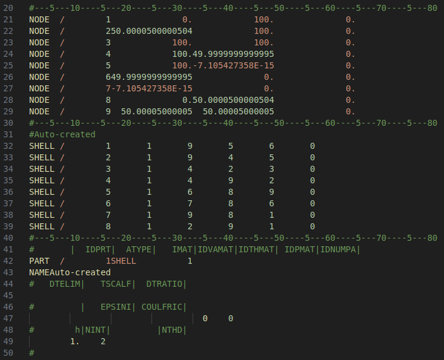
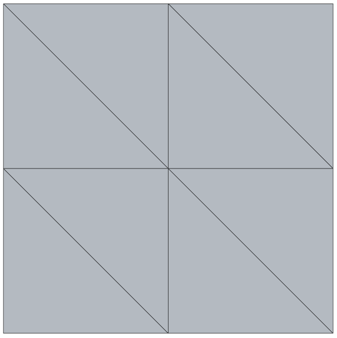

---
format:
  html:
    code-fold: false
jupyter: python3
---

# Parsing a mesh

Reading all the contents of a file is straightforward, but "parsing" a file can require some effort, i.e. when you want to extract specific parts based on the structure of the contents.
The following is an example of how this can be done for a certain file format that uses *fixed width* formatting.

::: {#fig-parsing layout-ncol=2}

{#fig-pamcrash}

{#fig-simplemesh}

Example file contents and the geometry it represents.
:::

The example file describes a two-dimensional finite element mesh consisting of eight connected triangles. We are interested in computing the total area of the geometry. 
To do this, we first need to parse all lines starting with `NODE` and `SHELL` from the file, then compute the area of each individual triangle. All other lines in the file are not of interest, and should be ignored.

The code below initializes two empty lists: `node_coords` and `connectivity`, then loops over each line of the file. Data is only appended to each list if a line begins with `NODE` or `SHELL`.
We use `.split()` to separate each line into parts by whitespace, making it easy to extract the values by index. Casting is used to specify the data type of each collected variable (int for IDs, float for coordinates).

After parsing, we create a `Mesh` object from MatKit, which provides a clean interface with 1-based node numbering (matching the file format). This eliminates the need for manual index translation.

```{python}
# | code-fold: show
import numpy as np
import matkit as mk

# Parse nodes and elements from file
node_coords = []
connectivity = []

with open('assets/100x100mm_8_linear_trias.pc', 'r') as file:
    for line in file:
        if line.startswith('NODE'): # Collect node coordinates
            parts = line.split()
            NID = int(parts[1])
            NX = float(parts[2])
            NY = float(parts[3])
            NZ = float(parts[4])
            node_coords.append([NX, NY, NZ])
        elif line.startswith('SHELL'): # Collect element connectivity (1-based)
            parts = line.split()
            EID = int(parts[1])
            N1 = int(parts[3])
            N2 = int(parts[4])
            N3 = int(parts[5])
            connectivity.append([N1, N2, N3])

# Create Mesh object with 1-based indexing
mesh = mk.Mesh(node_coords, connectivity)

print(f"Mesh info: {mesh.n_nodes} nodes, {mesh.n_elements} elements")
print(f"Element type: {mesh.element_type}")
```

Since we know the x-, y- and z-coordinates of each node in every element, we can utilize linear algebra to compute the area from the vector product of the element sides. Recall that the vector product $\mathbb{u} \times \mathbb{v}$ is a new vector $\mathbb{w}$ (perpendicular to both $\mathbb{u}$ and $\mathbb{v}$) whose magnitude $||\mathbb{w}|| = \sqrt{w_x^2 + w_y^2 + w_z^2}$ represents the area of the parallellogram defined by $\mathbb{u}$ and $\mathbb{v}$ as sides. The area of a triangular element is therefore $A_i = \frac{1}{2}||\mathbb{w}||$.

The `Mesh` class makes accessing node coordinates simple with `mesh.get_node()`, which uses natural 1-based numbering. We can iterate over elements using `mesh.iter_elements()`, which yields tuples of (element_number, node_IDs, node_coordinates) for each element.

```{python}
# | code-fold: show
# Compute total area
area = 0
for iel, nodes, coords in mesh.iter_elements():
    # iter_elements() yields: element_number, node_IDs, node_coordinates
    # Extract the three node coordinates for this triangular element
    n1 = coords[0]  # first node coordinates
    n2 = coords[1]  # second node coordinates
    n3 = coords[2]  # third node coordinates

    # Compute edge vectors and area
    u = n2 - n1  # triangle edge vector 1
    v = n3 - n1  # triangle edge vector 2
    w = np.cross(u, v)  # perpendicular to triangle
    area_e = 0.5 * np.linalg.norm(w)  # area of current element
    area += area_e  # add to total area

print(f"Total computed area: {area:.2f} mm²")
print(f"Expected area: {100*100:.2f} mm² (100mm × 100mm square)")
print(f"Verification: Error = {abs(area - 10000):.6f} mm²")
```

Perfect! The computed area matches the expected area exactly, verifying our mesh parsing and area calculation are correct.

Using `MatKit.Mesh` provides several advantages:
- **Natural 1-based indexing**: Node 1 is accessed as `mesh.get_node(1)`, matching the file format
- **Clean iteration**: `mesh.iter_elements()` yields element data with 1-based numbering (1, 2, 3, ...)
- **Direct coordinate access**: `iter_elements()` provides coordinates directly, no lookups needed
- **Self-documenting code**: The intent is clear without knowing array indexing details

## Visualizing the mesh

To better understand the mesh structure and verify our calculations, let's visualize both individual elements and the complete mesh.

### Visualizing the first element

Let's examine the first triangular element in detail, showing the edge vectors $\mathbb{u}$ and $\mathbb{v}$ and its area:

```{python}
# | code-fold: show
import matplotlib.pyplot as plt

# Get first element (element 1 in 1-based numbering)
iel = 1
nodes, coords = mesh.get_element(iel)  # Returns (node_IDs, node_coordinates)

# Extract node coordinates
n1 = coords[0]
n2 = coords[1]
n3 = coords[2]

# Compute vectors and area
u = n2 - n1
v = n3 - n1
w = np.cross(u, v)
area_e = 0.5 * np.linalg.norm(w)

# Visualization
fig, ax = plt.subplots(figsize=(6, 6))

# Plot triangle
triangle = np.array([[n1[0], n1[1]], [n2[0], n2[1]], [n3[0], n3[1]]])
mk.patch('Faces', np.array([[1, 2, 3]]), 'Vertices', triangle,
      'FaceColor', 'lightblue', 'EdgeColor', 'black', 'LineWidth', 2, ax=ax)

# Plot nodes
ax.plot(triangle[:, 0], triangle[:, 1], 'ko', markersize=10)

# Plot vectors u and v
ax.arrow(n1[0], n1[1], u[0], u[1], head_width=3, head_length=3,
         fc='red', ec='red', linewidth=2, label=r'$\mathbf{u}$')
ax.arrow(n1[0], n1[1], v[0], v[1], head_width=3, head_length=3,
         fc='blue', ec='blue', linewidth=2, label=r'$\mathbf{v}$')

# Add labels (using 1-based node numbers)
ax.text(n1[0]-5, n1[1]-5, f'n{nodes[0]}', fontsize=12, fontweight='bold')
ax.text(n2[0]+5, n2[1]-5, f'n{nodes[1]}', fontsize=12, fontweight='bold')
ax.text(n3[0]-5, n3[1]+5, f'n{nodes[2]}', fontsize=12, fontweight='bold')

# Add area annotation
centroid_x = (n1[0] + n2[0] + n3[0]) / 3
centroid_y = (n1[1] + n2[1] + n3[1]) / 3
ax.text(centroid_x, centroid_y, f'Area = {area_e:.1f} mm²',
        fontsize=11, ha='center', bbox=dict(boxstyle='round', facecolor='wheat', alpha=0.8))

ax.set_aspect('equal')
ax.grid(True, alpha=0.3)
ax.legend(fontsize=12)
ax.set_title(f'Element {iel}: Vectors u and v, Area = {area_e:.1f} mm²', fontsize=14)
ax.set_xlabel('x (mm)')
ax.set_ylabel('y (mm)')
plt.show()
```

### Visualizing the complete mesh

Now let's visualize the entire mesh to verify the geometry and area:

```{python}
# | code-fold: show
# Prepare data for patch function using Mesh
P = mesh.nodes[:, :2]  # Extract x, y coordinates from Mesh

# Extract connectivity for all elements
faces = np.array([mesh.get_element(iel)[0] for iel in range(1, mesh.n_elements + 1)])

# Visualize mesh
fig, ax = plt.subplots(figsize=(6, 6))

# Plot mesh with semi-transparent white faces and black edges
mk.patch('Faces', faces, 'Vertices', P,
         'FaceColor', 'white',
         'EdgeColor', 'black',
         'EdgeAlpha', 0.3,
         'LineWidth', 1.5,
         ax=ax)

# Plot nodes
ax.plot(P[:, 0], P[:, 1], 'o', color='blue', markersize=6)

# Add grid for area verification
ax.grid(True, alpha=0.5, linewidth=0.5)
ax.set_aspect('equal')
ax.set_xlim(-10, 110)
ax.set_ylim(-10, 110)
ax.set_xlabel('x (mm)', fontsize=12)
ax.set_ylabel('y (mm)', fontsize=12)
ax.set_title(f'100mm × 100mm Square Mesh\nTotal Area: {area:.2f} mm²', fontsize=14)

plt.show()
```

The visualization clearly shows the 100mm × 100mm square mesh. The grid helps verify the dimensions, and the computed area of 10000 mm² matches the expected area perfectly.

### Download the mesh file

[Download 100x100mm_8_linear_trias.pc](assets/100x100mm_8_linear_trias.pc)

## Example 2: Unit circle mesh

Let's apply the same parsing and visualization techniques to a more complex geometry: a unit circle. This mesh was generated with approximately 100 triangular elements.

```{python}
# | code-fold: show
# Parse circle mesh
node_coords_circle = []
connectivity_circle = []

with open('assets/unit_circle_mesh.pc', 'r') as file:
    for line in file:
        if line.startswith('NODE'):  # Collect node coordinates
            parts = line.split()
            NID = int(parts[1])
            NX = float(parts[2])
            NY = float(parts[3])
            NZ = float(parts[4])
            node_coords_circle.append([NX, NY, NZ])
        elif line.startswith('SHELL'):  # Collect element connectivity (1-based)
            parts = line.split()
            EID = int(parts[1])
            N1 = int(parts[3])
            N2 = int(parts[4])
            N3 = int(parts[5])
            connectivity_circle.append([N1, N2, N3])

# Create Mesh object with 1-based indexing
mesh_circle = mk.Mesh(node_coords_circle, connectivity_circle)

print(f"Circle mesh: {mesh_circle.n_nodes} nodes, {mesh_circle.n_elements} elements")
```


### Computing the area

```{python}
# | code-fold: show
# Compute area using Mesh class
area_circle = 0
for iel, nodes, coords in mesh_circle.iter_elements():
    # iter_elements() yields: element_number, node_IDs, node_coordinates
    # Extract the three node coordinates for this triangular element
    n1 = coords[0]
    n2 = coords[1]
    n3 = coords[2]

    # Compute edge vectors and area
    u = n2 - n1
    v = n3 - n1
    w = np.cross(u, v)
    area_e = 0.5 * np.linalg.norm(w)
    area_circle += area_e

print(f"\nTotal computed area: {area_circle:.6f}")
print(f"Expected area (π × r²): {np.pi:.6f}")
print(f"Verification: Error = {abs(area_circle - np.pi):.6f}")
print(f"Relative error: {100 * abs(area_circle - np.pi) / np.pi:.4f}%")
```


The computed area is slightly larger than π because the generated mesh extends slightly beyond the unit circle boundary (maximum radius ≈ 1.15). This demonstrates how the mesh resolution and boundary approximation affect the computed geometry.

### Visualizing the circle mesh

```{python}
# | code-fold: show
# Prepare data for visualization using Mesh
P_circle = mesh_circle.nodes[:, :2]  # Extract x, y coordinates from Mesh

# Extract connectivity for all elements
faces_circle = np.array([mesh_circle.get_element(iel)[0] for iel in range(1, mesh_circle.n_elements + 1)])

# Visualize
fig, ax = plt.subplots(figsize=(8, 8))

# Plot mesh
mk.patch('Faces', faces_circle, 'Vertices', P_circle,
         'FaceColor', 'white',
         'EdgeColor', 'black',
         'EdgeAlpha', 0.3,
         'LineWidth', 1.0,
         ax=ax)

# Plot nodes
ax.plot(P_circle[:, 0], P_circle[:, 1], 'o', color='blue', markersize=4)

# Add grid for verification
ax.grid(True, alpha=0.5)
ax.set_aspect('equal')
ax.set_xlim(-1.2, 1.2)
ax.set_ylim(-1.2, 1.2)

# Draw unit circle outline for reference
theta = np.linspace(0, 2*np.pi, 100)
ax.plot(np.cos(theta), np.sin(theta), 'r--', linewidth=2, alpha=0.5, label='Unit circle')

ax.set_xlabel('x', fontsize=12)
ax.set_ylabel('y', fontsize=12)
ax.set_title(f'Unit Circle Mesh ({mesh_circle.n_elements} elements)\n' +
             f'Computed Area: {area_circle:.6f} (Expected: π = {np.pi:.6f})',
             fontsize=14)
ax.legend()
plt.show()
```

The circle mesh visualization shows a well-structured triangular mesh that closely approximates the unit circle. The grid provides a reference for verifying the radius, and the computed area confirms the mesh quality.

### Download the circle mesh file

[Download unit_circle_mesh.pc](assets/unit_circle_mesh.pc)
